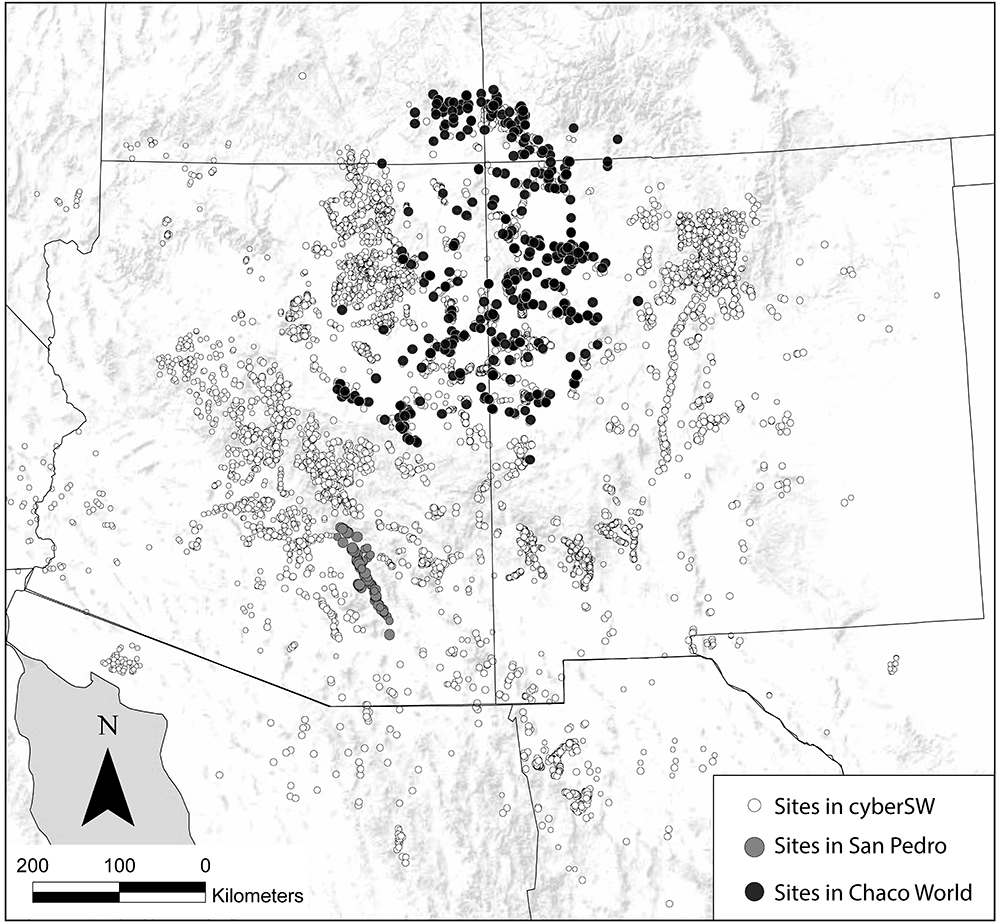
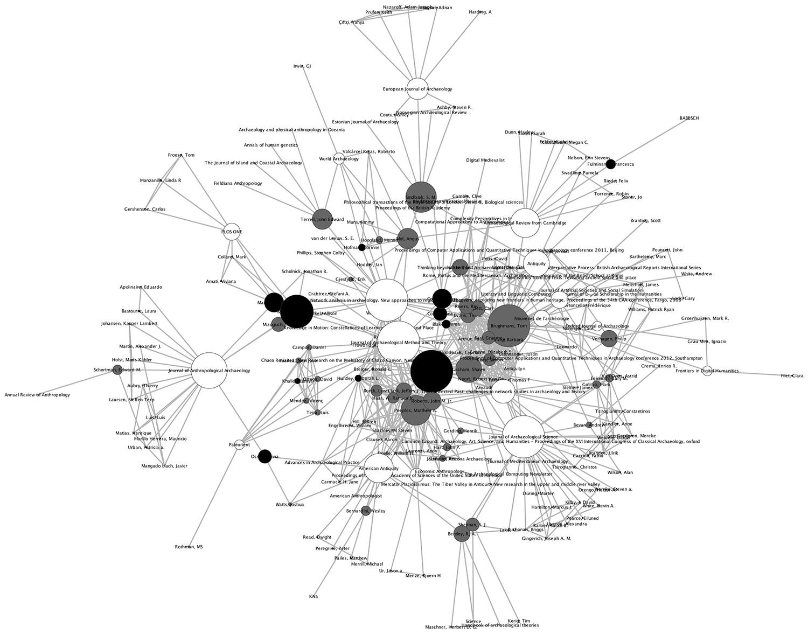
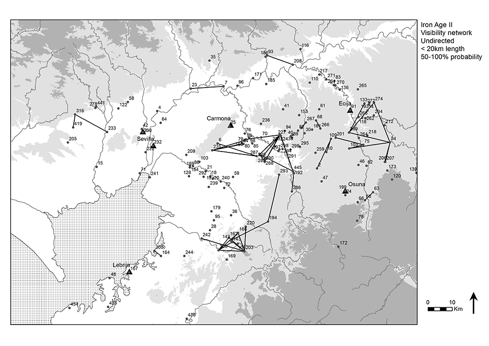

# (PART) **PART II: Work While You Read** {-}

# Data and Workspace Setup{#DataAndWorkspace}

This section provides downloadable files for the network data sets used in this online companion and in the book as well as information on the primary R packages used for analysis and visualization throughout the tutorials in this document. We provide very brief instructions for importing these data into R using R-studio and some guidance on setting up your R-studio working environment. For additional guidance see [Getting Started in R](#GettingStarted). 

## Data Sets{#DataSets}

In the analyses illustrated in this document we use a number of real and simulated archaeological data sets to serve as examples for particular data types and techniques. Most of the data sets used here are provided in .csv (comma separated value) or .RData formats and can be downloaded so that you can follow along with these analyses on your own computer. We encourage you to explore these files and see how they are formatted as a guide for setting up your own data sets.

The data used here include a range of different network data formats and types. The primary data sets are described in detail in Brughmans and Peeples (2022) Chapter 2.8. Note that where spatial locations for archaeological sites are provided the locations have been randomly jittered up to 10 kilometers from their actual locations to maintain data security.

For the files below you can right click and "save as" to save them for use locally. Note that there are many additional data sets relating to the replication of particular figures in the book that are provided where the code for that particular figure occurs. If you'd like to just download everything at once [see the next section](#Everything)

### Just Give Me Everything {#Everything}

Hey, we get it. You're busy and just want all of the data in one convenient package. We provide all of the data used in the appendix here in a single .zip file for you to download. To follow along with the examples in this appendix you need to choose an R working directory and place the contents of the *.zip folder within it such that all of the individual files are contained within a folder called "data". Note that this includes all of the additional files that are required for reproducing particular figures as well.

**[All_data.zip](All_data.zip)** - A single compressed file containing all of the data files used in this appendix.

### Roman Road Networks{#RomanRoad}

The development of an elaborate road system is one of the most enduring legacies of the Roman Republic and Empire. Areas that came under Roman control were connected to Rome and important provincial centers through entirely new roads as well as redeveloped existing roads. From roughly the second century AD onward this resulted in an integrated terrestrial transport network connecting North-Africa, the Middle East, and western and southern Europe. Much of the subsequent development of transport systems in these regions built on this Roman system. 

Our primary source for roads of the entire Roman world is the Barrington Atlas of the Greek and Roman World (Talbert 2000) and their digitization by the Ancient World Mapping Center (2012). In many of our examples we will focus in particular on the roads of the Iberian Peninsula, which have been digitized in great detail by Pau de Soto (de Soto and Carreras 2021). In our analyses of the Roman road network ancient settlements are represented as nodes and the existence of a road between two settlements is represented by an edge. We also include the length of a road as an edge attribute.

* **[Hispania_nodes](data/Hispania_nodes.csv)** - NodeIDs and names for Roman era settlements in the Iberian Peninsula along with names and latitude and longitude locations in decimal degrees.
* **[Hispania_roads](data/Hispania_roads.csv)** - Edge list of road connections using NodeIDs from Hispania_nodes file. This file contains a "weight" variable defined for each edge which denotes the length of the road segment.

The [Stanford ORBIS project](https://orbis.stanford.edu/) provides additional data from across the Roman World including settlements, roads, and characterizations of travel time. Some of these data have been wrapped into a convenient R compendium by [Sebastian Heath](https://github.com/sfsheath) and the data are available on GitHub here:


```r
if (!require("devtools")) install.packages("devtools")
devtools::install_github("sfsheath/cawd")
```

{width=100%}

### Southwest Social Networks Project Ceramic Similarity Networks{#SWSN}

The Southwest Social Networks (SWSN) Project (and subsequent [cyberSW](https://cybersw.org) project) is a large collaborative effort focused on exploring methods and models for network analysis of archaeological data to better understand patterns of interaction, population movement, and demographic change across the U.S. Southwest and Mexican Northwest through time (ca. A.D. 800-1800; Borck et al. 2015; Giomi et al. 2021; Mills et al. 2013a; 2013b; 2015; 2018; Peeples and Haas 2013; Peeples et al. 2016; Peeples and Roberts 2013). During the interval considered by this project the region was inhabited largely by sedentary agricultural populations (though more mobile populations were also present throughout this period) with communities as large as several thousand people at the peak. The region is blessed with excellent archaeological preservation, a fine grained chronology anchored by dendrochronological dates, and nearly 150 years of focused archaeological research. 

The SWSN/cyberSW project team has gathered a massive database with information on the location and size of tens of thousands of archaeological sites and ceramic and other material cultural typological frequency data consisting of millions of objects to explore how patterns of material similarity, exchange, and technology change across time and space in the study area. These data as well as tools needed to analyze them are available in an online platform called [cyberSW (cyberSW.org)](https://cybersw.org). This online platform even allows you to explore these data directly in your internet browser. The size and complexity of the SWSN/cyberSW data make it a particularly good example for discussing the decision processes involved in visualizing and analyzing large networks. 

In several sections of this book we also use subsets of this larger data set: the San Pedro Valley, and the Chaco World. The San Pedro Valley in southern Arizona is a well-studied portion of the SWSN study area (see Clark and Lyons 2012; Gerald 2019) that was an early focus of network methodological exploration by the team (Mills et al. 2013b). This data subset includes detailed ceramic typological frequency for all known major settlements across this region during the late pre-Hispanic period (ca. A.D. 1200-1450). The Chaco World is a large-scale social and political system that spanned much of the Colorado Plateau ca. A.D. 800-1150. This settlement system was marked by the construction of massive public architectural features known as great houses and great kivas. This subset of the database includes information on architecture and ceramic typological data for a large portion of the known Chacoan architectural complexes throughout the U.S. Southwest. The Chaco World has been a major focus of the SWSN/cyberSW project (Giomi et al. 2021; Giomi and Peeples 2019; Mills et al. 2018). 

In these networks, individual settlements are treated as nodes and edges are defined and weighted based on similarities in the ceramic wares recovered at those settlements. Ceramic data used to generate networks are apportioned into a sequence of 50-year chronological intervals using methods described in detail by Roberts and colleagues (2012) and Ortman (2016; see discussion in Mills et al. 2018) so that we are able to explore change through time. Site locations and other site attribute data are also considered in some examples. R implementations of these chronological apportioning methods are available on GitHub as well ([R implementation of Roberts et al. 2012](https://github.com/mpeeples2008/CeramicApportioning), [R implementation of Ortman 2016](https://github.com/mpeeples2008/UniformProbabilityDensityAnalysis)).

* **[SWSN Attribute Data AD 1300-1350](data/AD1300attr.csv)** - Attribute data for SWSN sites dating between AD 1300 and 1350 including site name, site sub-region (Macro), and jittered easting and northing UTM coordinates (Zone 12N). 
* **[SWSN Similarity Data AD 1300-1350](data/AD1300sim.csv)** - Symmetric similarity matrix based on Brainerd-Robinson similarities for all SWSN sites dating between AD 1300 and 1350.
* **[The Chaco World Attribute Data AD 1050-1100](data/AD1050attr.csv)** - Attribute data for sites with Chacoan architectural features dating between AD 1050 and 1100 including site IDs, site names, site sub-regions, counts of different kinds of public architectural features, and jittered easting and northing UTM site locations (Zone 12N). 
* **[The Chaco World Ceramic Data AD 1050-1100](data/AD1050cer.csv)** - Ceramic count data by ware for sites with Chacoan architectural features dating between AD 1050 and 1100.
* **[The Chaco World Network AD 1050-1100](data/AD1050net.csv)** - Adjacency matrix of binarized network of ceramic similarity for sites with Chacoan architectural features dating between AD 1050 and 1100.
* **[San Pedro Networks throgh Time](data/Figure6_20.Rdata)** - An .RData file that contains `igraph` network objects for the San Pedro region ceramic similarity networks for AD1250-1300, AD1300-1350, and AD1350-1400.

{width=100%}

### Cibola Region Technological Similarity Networks{#Cibola}

The Cibola region along the Arizona and New Mexico border in the U.S. Southwest is a large and diverse physiographic region spanning the southern edge of the Colorado Plateau and the ancestral homeland of the contemporary Zuni (A:shiwi) people. Peeples and colleagues (Peeples 2011, 2018; Peeples et al. 2021) have explored patterns of technological similarity and communities of practice in this region at a series of sites dating ca. A.D. 1100-1350 through explorations of corrugated ceramic cooking pots. Corrugated pots, which are produced across much of the U.S. Southwest from at least the 9th through the 14th centuries, are coiled ceramic vessels where the coils used to make the vessel are never fully smoothed. Thus, these ceramics retain substantial amounts of evidence of the specific techniques used to produce them.

In the book we use data on ceramic technological production techniques to generate similarity networks originally published by Peeples (2011; 2018). In these networks each settlement is treated as a node with similarity metrics defining the weights of edges between pairs of sites based on an analysis of a number of metric and coded attributes of individual ceramic vessels. In addition to these material cultural data, we also have additional site attributes such as location and the types and frequency of public architectural features.

Ceramic technological data from Peeples (2018): Additional data and documentation from this project is available on tDAR [in this collection](https://core.tdar.org/project/427899/connected-communities-networks-identity-and-social-change-in-the-ancient-cibola-world). Nodes are defined as individual settlements with edges defined based on similarities in the technological attributes of cooking pots recovered at those settlements. For more details on the methods and assumptions used to define these networks see Peeples (2018, pg. 100-104). 

* **[Cibola Ceramic Technological Clusters](data/Cibola_clust.csv)** - Counts of ceramic technological clusters for sites in the Cibola region sample.
* **[Cibola Site Attributes](data/Cibola_attr.csv)** - Site location, public architectural feature types, and sub-region designations for sites in the Cibola region sample.
* **[Cibola Binary Network Edge List](data/Cibola_edgelist.csv)** - Binary edge list of Cibola technological similarity network.
* **[Cibola Binary Network Adjacency Matrix](data/Cibola_adj.csv)** - Binary adjacency matrix of Cibola technological similarity network.
* **[Peeples2018.Rdata](data/Peeples2018.Rdata)** - This file contains a number of objects in R format including the site attributes (`site_info`), a symmetric Brainerd-Robinson similarity matrix (`ceramic_br`), a binary network object in the `statnet/network` format (`brnet`), and a weighted network object in the `network` format (`brnet_w`) 

{width=100%}

### Himalayan Visibility Networks{#Himalaya}

Hundreds of forts and small fortified structures are located on mountain tops and ridges in the central Himalayan region of Garhwal in Uttarakhand (India). Despite being such a prominent feature of the history of the region that is interwoven with local folklore (Garhwal is derived from 'land of forts'), this fortification phenomenon has received very little research attention. It might have had its origins during the downfall of the Katyuri dynasty in the 11th century and continued up to the 15th century when the region was consolidated by the Parmar dynasty and possibly even later as attested by Mughal, Tibetan, and British aggression.

In the book we use this research context as an example of spatial networks and more specifically visibility networks.This is made possible thanks to the survey of forts in the region performed in the context of the PhD project by Dr Nagendra Singh Rawat (2017). We use a catalog of 193 sites (Rawat et al. 2020, Appendix S1), and use the case of Chaundkot fort and its surroundings as a particular case study. Chaundkot fort is theorized to have been one of the key strongholds in the region and is also the only one to have been partly excavated (Rawat and Nautiyal 2020). In these case studies we represent strongholds as nodes, and the ability for a line-of-sight to exist between observers located at a pair of strongholds is represented by a directed edge. The length of each line-of-sight is represented by an edge attribute.

* **[Himalayan Node data](data/Himalaya_nodes.csv)** - Node attribute data for the Himalayan sites including locations in lat/long, elevation, site name/type, and descriptions of landscape features.
* **[Himalayan Edge List](data/Himalaya_visiblity.csv)** - Edge list data with information on connections among nodes within 25kms of each other with information on the distance and whether or not the target site is visible from the source. Note that only edges with `Visible = TRUE` should be included as activated edges.

{width=100%}

### Archaeological Publication Networks{#ArchPubs}

Our knowledge and stories of past human behavior are as much shaped by the material remains we excavate, as they are by the actions and interactions of the archaeologists that study them. Aspects of these actions and interactions are formally represented in publications. Such papers can be co-authored, reflecting scientific collaboration networks and communities of practice. Authors cite other authors’ works to indicate explicitly that they were influenced by it or that it is related to the paper’s subject matter.

In previous work, we have turned the tools of archaeological network science on archaeological network researchers themselves (Brughmans 2013; Brughmans and Peeples 2017). We studied the co-authorship and citation practices of the more than 250 publications that have applied formal network methods to archaeological research topics from 1968 to the present. From a list of publications, an undirected co-authorship network can be made by representing individual authors as nodes, and connecting a pair of authors with an edge if they have been co-authors on one or more papers, with edge values representing the number of papers they co-authored. Moreover, a directed citation network can be made from the bibliographies of this list of publications. In a citation network, each node represents an individual publication which is connected to all other publications in its bibliography with a directed edge. The edge goes from the citing publication to the cited publication, so it represents the source and direction of academic influence as explicitly expressed in publication. We use networks of archaeological network research publications throughout this volume to illustrate concepts like the acyclic structure of citation networks.

* **[Publication Networks Attribute Data](data/biblio_attr.csv)** - Attribute data table including information on publications including a unique key identifier, publication type, publication title, publication date, and the author list separated by semi-colons.
* **[Publication Networks Co-Authorship Incidence Matrix](data/biblio_dat.csv)** - An incidence matrix with unique publications as rows and authors as columns.

{width=100%}

### Iron Age Sites in Southern Spain{#Guadalquivir}

The Guadalquivir river valley in the south of Spain between present-day Seville and Córdoba was densely urbanized in the late Iron Age (early 5th c. B.C. to late 3rd c. B.C.). Many settlements were dotted along the rivers and the southern part of the valley (Fig. 2.6), and this settlement pattern was focused on nuclear settlements sometimes referred to as oppida. Some of these reveal defensive architecture and many are located on elevations. Previous studies of Iron Age settlements in the region have explored possible explanations for their locations (Keay and Earl 2011; Brughmans et al. 2014, 2015). Given their elevated locations, one theory that has received considerable attention was intervisibility. Could small settlements surrounding oppida be seen from them, and could oppida be located partly to allow for visual control over surrounding settlements? Did groups of Iron Age settlements tend to be intervisible, forming communities that were visible on a daily basis? Were there chains of intervisibility that allowed for passing on information from one site to another via visual smoke or fire signals, and did these chains follow the other key communication medium in the area: the navigable rivers? 

These questions have been explored in previous research using GIS and network methods, using a data set of 86 sites and lines-of-sight connecting pairs of Iron Age settlements at distances up to 20km at which large fire and smoke signals would be visible (more about this data set and research topic: Keay and Earl 2011; Brughmans et al. 2014, 2015). To account for errors in the Digital Elevation Model (DEM), a probabilistic line-of-sight analysis was performed that introduces random errors into the DEM which can have a blocking or enhancing effect on the lines-of-sight. The locations of these 86 sites and the network displayed in figure 2.9 are also available as Appendix A in Brughmans et al. 2014. These locations are used in Chapter 7 of the book to illustrate spatial network models that explore different geographical structures that might underlie the settlement pattern.

* **[Guadalquivir settlement data](data/Guadalquivir.csv)** - Site number and locations in decimal degrees for all sites in the Guadalquivir survey area.

{width=100%}

## Importing Data in R{#Importing}

This section briefly describes how the data provided above (or your own data) can be imported in to R for further analyses (see [Working With Files](#WorkingWithFiles) for more info). Before running the code below, however, you need to ensure that your R session is set to the correct working directory (the location where you placed the .csv files you just downloaded). To do that, go to the menu bar at the top and click Session > Set Working Directory > Choose Directory and navigate to the place on your hard drive where these files reside. 

For this example we will read in the `Cibola_edgelist.csv` file and define an object called `el1` which includes the data in that file using the `read.csv()` command. Note that in this case the file we want to read is in a sub-folder of our working directory called "data" so we need to use the `data/` prefix before the file name to correctly call that file. If you do not chose to use a sub-folder or if you call your folder something else, you will need to modify the `data/` section of the code.


```r
# read in data with first row representing column names (header=TRUE)
el1 <- read.csv(file = "data/Cibola_edgelist.csv", header = TRUE)
# look at the first few rows
head(el1)
```

```
##           FROM                   TO
## 1 Apache Creek         Casa Malpais
## 2 Apache Creek         Coyote Creek
## 3 Apache Creek         Hooper Ranch
## 4 Apache Creek      Horse Camp Mill
## 5 Apache Creek        Hubble Corner
## 6 Apache Creek Mineral Creek Pueblo
```

In addition to the .csv files, several examples in this book and several of the data sets above are provide as .RData files which can be read directly in R and can contain multiple R objects. These can be read directly into the R environment using the `load()` function. See the example below. Again note that you must specify the specific directory within the working directory where the file is located.


```r
load("data/map.RData")
```

## Required/Suggested R Packages{#PrimaryPackages}

<div class="rmdnote">
<p>In this appendix we rely on a number of pre-existing R packages. In
order to use these packages in a new installation of R and R-studio, you
first need to install them. Note that you will only need to do this once
on a new installation of R. To install packages, you can click on the
“Packages” tab in the window in the bottom right of R studio, then click
the “Install” button at the top and type the names of the packages
separated by commas. Alternatively you can install packages from the
console by simply typing
<code>install.packages("nameofpackagehere")</code>.</p>
</div>

`install.packages(c("statnet", "igraph"))`

We use a number of R packages in the modules here and in the book for manipulating and analyzing network data and for other general analyses and procedures. The most frequently used network packages include:

* **[igraph (Csardi and Nepusz 2006)](https://igraph.org/)** - analytical routines for simple graphs and graph analysis
* **[statnet (Krivitsky et al. 2020)](http://statnet.org/)** - A suite of packages designed for the management and statistical analysis of networks including `network`, `sna`, `ergm`, and others.
* **[intergraph (Bojanowski 2015)](https://cran.r-project.org/web/packages/intergraph/intergraph.pdf)** - a set of routines for coercing objects between common network formats in R
* **[ggraph (Pederson 2021)](https://CRAN.R-project.org/package=ggraph)** - a powerful graph visualization package that is based off of the ggplot2 plotting format

Throughout this Online Companion, we will consistently rely on `igraph` and `statnet` (`statnet` is actually a suite of packages that includes `sna`, `network`, `ergm`, and others). For the most part these two packages do many of the same things. You can use them to calculate centrality metrics, define groups, or evaluate other network structures. In general `igraph` is a bit more centered on complex networks and mathematical models and `statnet` and affiliated packages are more focused on social network analysis though there is considerable overlap. 

Although `igraph` and the `statnet` suite of packages have many of the same features, they are not directly compatible and use different network formats to store data in R. Adding to the potential confusion, function call names are often the same between the two packages. For example degree centrality is calculated using a `degree()` function in both. If you simply use the `degree()` call R will use the function from whichever package was initialized most recently. If this is the wrong package for your data format, you will get an error. In order to avoid such errors and to clear up ambiguity we use the package name followed by `::` in the function call (i.e., `igraph::function_name` or `sna::function_name`) so that R knows which package we intend to use. You can do this with any R function where you want to specify the package (`package::function_name`).

In general in this Online Companion we use the `igraph` package wherever possible as we find the data format and especially the functions for converting between network data types to be the most useful and intuitive for most kinds of analyses. We use `statnet` and affiliated packages in specific cases where `igraph` lacks specific functionality or important features. Luckily the package called `intergraph` lets us easily convert network objects from one format to another as we will see in the examples ahead. 

Finally, we recommend installing `ggraph` as this is a very useful and intuitive package that allows for diverse network visualizations and customization. These four packages account for the bulk of the examples in this book. We discuss the use of this package in detail in the [visualization section](#Visualization) of this guide.

### Should I Just Install Everything?{#ShouldIInstall}

No matter how you plan on working with these documents, you should install the packages in the following chunk at a minimum by running the code below. These packages will get you through everything in Sections 1 through 4 and much of the Sections 5 and 6.


```r
packages <- c("igraph", "statnet", "intergraph", "ggraph",
              "reshape2", "ggmap", "vegan", "sf", "tidyverse")

install.packages(setdiff(packages, rownames(installed.packages())))
```

If you have plenty of disk space and time and don't wont to worry about installing packages piecemeal, you can install everything at the same time using the code below. Note that there are a large number of packages and dependencies here and many are only used in one or two places in this Online Companion. Most of the packages are used in the [network visualization](#Visualization) section for making plots with very specific features. We generally recommend that you install packages as you need them while you work through this document but you do you. 

If you choose to install everything, however, you can simply run the chunk of code below. Note that the code below will not reinstall packages already installed in your current version of R. Note if you are familiar with Git and R Environments, it will be much faster to just use the `renv::restore()` function to build an environment from the repository. See the [Reproducibility section](#Repro) in the introduction for more information.


```r
packages <- c("ape", "devtools", "igraph", "statnet", "intergraph",
  "tnet", "ggplot2", "rjson", "d3r", "cccd", "networkD3", "visNetwork",
  "GISTools", "rgeos", "maptools", "sf", "igraphdata", "ggrepel",
  "ggsn", "tidyverse", "superheat", "ggplotify", "ggforce", "colorspace",
  "ggmap", "dplyr", "ggpubr", "ggraph", "reshape2", "multinet",
  "RColorBrewer", "Rcpp", "deldir", "vegan", "geosphere", "networkDynamic",
  "scatterplot3d", "patchwork", "concaveman", "latticeExtra")

install.packages(setdiff(packages, rownames(installed.packages())))

devtools::install_github("liamgilbey/ggwaffle")

if (!requireNamespace("BiocManager", quietly = TRUE))
  install.packages("BiocManager")
BiocManager::install("RBGL")
```


<div class="rmdwarning">
<p>In addition to the R packages listed above, there is one procedure
used in this Online Companion that requires you to have an installation
of Python 3.7 or 3.8 with particular packages associated with it. In
order to implement these sections of code, you will need to also run the
following lines of code. Note that this is a large install that takes
about about 1.4 GB of hard drive space so only do this if you have the
space and REALLY want to explore edge bundling (<a
href="#Figure_6_17">see Edge Bundling Visualizations</a>). You will be
able to reproduce everything in this document except for two chunks of
code without this so feel free to sit this one out.</p>
</div>

To install Python with the required libraries, run the following chunk of code. Keep in mind this will take seeral minutes and about 1.4 GB of disk space:


```r
install.packages("edgebundle", "reticulate")
library(edgebundle)
library(reticulate)
install_bundle_py(method = "auto", conda = "auto")
```

### R Environment{#Environment}

This version of the book was built with R version 4.2.0 (2022-04-22 ucrt) and the following packages:


|package        |version |source         |
|:--------------|:-------|:--------------|
|ape            |5.6-2   |CRAN (R 4.2.0) |
|bookdown       |0.26    |CRAN (R 4.2.0) |
|bslib          |0.3.1   |CRAN (R 4.2.0) |
|ca             |0.71.1  |CRAN (R 4.2.0) |
|cccd           |1.6     |CRAN (R 4.2.0) |
|colorspace     |2.0-3   |CRAN (R 4.2.0) |
|concaveman     |1.1.0   |CRAN (R 4.2.0) |
|d3r            |1.0.0   |CRAN (R 4.2.0) |
|deldir         |1.0-6   |CRAN (R 4.2.0) |
|devtools       |2.4.3   |CRAN (R 4.2.0) |
|downlit        |0.4.0   |CRAN (R 4.2.0) |
|dplyr          |1.0.9   |CRAN (R 4.2.0) |
|edgebundle     |0.3.1   |CRAN (R 4.2.0) |
|geosphere      |1.5-14  |CRAN (R 4.2.0) |
|ggforce        |0.3.3   |CRAN (R 4.2.0) |
|ggmap          |3.0.0   |CRAN (R 4.2.0) |
|ggplot2        |3.3.6   |CRAN (R 4.2.0) |
|ggplotify      |0.1.0   |CRAN (R 4.2.0) |
|ggpubr         |0.4.0   |CRAN (R 4.2.0) |
|ggraph         |2.0.5   |CRAN (R 4.2.0) |
|ggrepel        |0.9.1   |CRAN (R 4.2.0) |
|ggsn           |0.5.0   |CRAN (R 4.2.0) |
|GISTools       |0.7-4   |CRAN (R 4.2.0) |
|igraph         |1.3.1   |CRAN (R 4.2.0) |
|intergraph     |2.0-2   |CRAN (R 4.2.0) |
|knitr          |1.39    |CRAN (R 4.2.0) |
|latticeExtra   |0.6-29  |CRAN (R 4.2.0) |
|maptools       |1.1-4   |CRAN (R 4.2.0) |
|multinet       |4.0.1   |CRAN (R 4.2.0) |
|netdiffuseR    |1.22.3  |CRAN (R 4.2.0) |
|networkD3      |0.4     |CRAN (R 4.2.0) |
|networkDynamic |0.11.2  |CRAN (R 4.2.0) |
|patchwork      |1.1.1   |CRAN (R 4.2.0) |
|RColorBrewer   |1.1-3   |CRAN (R 4.2.0) |
|Rcpp           |1.0.8.3 |CRAN (R 4.2.0) |
|reshape2       |1.4.4   |CRAN (R 4.2.0) |
|reticulate     |1.25    |CRAN (R 4.2.0) |
|rgeos          |0.5-9   |CRAN (R 4.2.0) |
|rjson          |0.2.21  |CRAN (R 4.2.0) |
|rmarkdown      |2.14    |CRAN (R 4.2.0) |
|scatterplot3d  |0.3-41  |CRAN (R 4.2.0) |
|sf             |1.0-7   |CRAN (R 4.2.0) |
|statnet        |2019.6  |CRAN (R 4.2.0) |
|superheat      |0.1.0   |CRAN (R 4.2.0) |
|tidyverse      |1.3.1   |CRAN (R 4.2.0) |
|vegan          |2.6-2   |CRAN (R 4.2.0) |
|visNetwork     |2.1.0   |CRAN (R 4.2.0) |
|xml2           |1.3.3   |CRAN (R 4.2.0) |

## Suggested Workspace Setup{#WorkspaceSetup}

In order to follow along with the examples in this Online Companion it will be easiest if you set up your R working directory in a similar format to that used in creating it. Specifically, we suggest you create a new working directory and create an R studio project tied to that specific directory. 

In order to do this, open R-Studio and go to "File > New Project" and click on "New Directory > New Project" in the dialog and then give it an appropriate name and location on your disk. Next, navigate to that location on your disk and create two sub-folders: one called "data" and one called "scripts" (directory names are case sensitive). Place any of the data files you downloaded above or in any other section of this Online Companion in the "data" folder and any R script files you download in the "scripts" folder. 

<div class="rmdwarning">
<p>Note that if you chose the “Just Give Me Everything” download you
will have a .zip file that already contains a sub-folder called “data”
so be sure you’re not double nesting your folders (you want
“working_directory/data” not “working_directory/data/data”).</p>
</div>

When you close R you will see a dialog that asks if you want to save your workspace image. If you do this and provide a name, you can reopen the .RData file at a later time and pick up exactly where your previous session left off.

If you are new to the R environment and file structures, we suggest you review the [Getting Started with R](#GettingStarted) section for more information.
